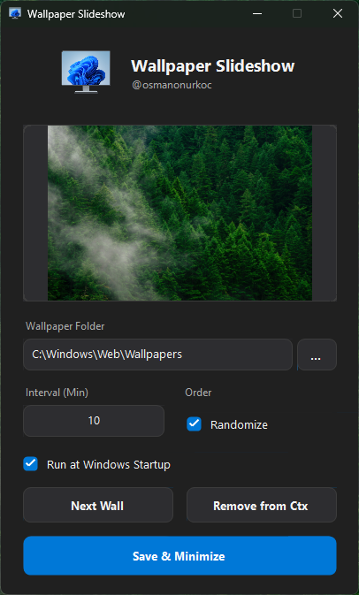
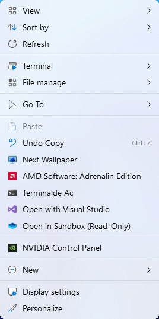

# 🖼️ Windows Wallpaper Slideshow

A lightweight, high-performance C# utility that brings dynamic wallpaper rotation to Windows 10 and 11. Ported from Python to native .NET 8 to reduce memory usage by 90%.

[](https://github.com/osmanonurkoc/wallchanger/releases/latest)


## 📸 Overview

*A set-and-forget utility to keep your desktop fresh.*

This tool runs quietly in the system tray, rotating your desktop wallpaper from a selected folder at user-defined intervals. It integrates seamlessly with the Windows ecosystem, supporting dark mode, startup triggers, and even a "Next Wallpaper" option in the right-click context menu.

## 📸 Screenshots

<p align="center">
  
  
</p>

### Why the rewrite?
The original Python version consumed ~120MB of RAM due to the embedded interpreter. This native C# port offers the same features with **less than 15MB RAM usage** and zero dependencies.

## ✨ Key Features

* **🚀 Native Performance:** Written in C# with Win32 API integration for minimal footprint.
* **🎨 Theme-Aware UI:** The settings window automatically detects and switches between Dark and Light modes based on your Windows personalization settings.
* **📂 Smart Folder Scanning:** Recursively scans directories for valid image formats (`.jpg`, `.png`, `.bmp`).
* **🖱️ Context Menu Integration:** Adds a "Next Wallpaper" option to your Desktop right-click menu for instant changes without opening the app.
* **🎲 Random or Sequential:** Choose to shuffle your collection or cycle through it in order.
* **👻 Unobtrusive:** Minimizes to the System Tray and handles logic silently in the background.

## 🚀 Getting Started

### Prerequisites
* **OS:** Windows 10 or Windows 11.
* **Runtime:** [.NET Desktop Runtime 6.0](https://dotnet.microsoft.com/en-us/download/dotnet/6.0) or higher.

### Installation

1. Download the latest `WallpaperSlideshow.exe` from the **[Releases Page](https://github.com/osmanonurkoc/wallchanger/releases/latest)**.
2. Place the executable in a permanent folder (e.g., `C:\Tools\WallpaperSlideshow`).
3. Double-click to run.
4. Select your wallpaper folder and set your interval.
5. Click **"Add to Ctx"** to enable the right-click menu integration.
6. Click **Save & Minimize**.

## 🛠️ Compilation (For Developers)

The project is designed as a **Single-File Application** for easy portability.

**Build Command:**
Use the provided `build_script.bat` or run:
```bash
dotnet publish -c Release -r win-x64 --self-contained true -p:PublishSingleFile=true
